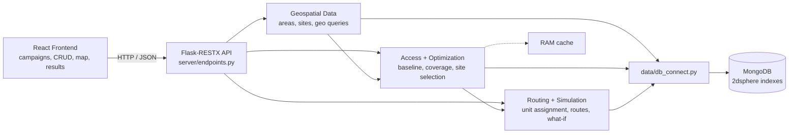
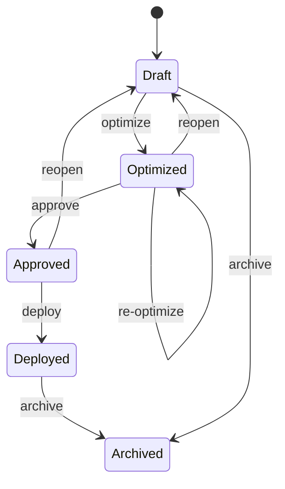

# Mobile Vaccination Access Planning and Deployment Optimization

A geographic decision-support app that helps an organization decide where to send a limited number of mobile vaccination clinics. It manages geographic data and campaigns, finds areas with poor access to existing providers, recommends mobile clinic sites, splits doses among them within the constraints, and plans routes and what-if scenarios.

The app answers four questions in order:

**Where is access poor? → Where should we deploy? → How should we deploy? → What changes if the constraints change?**

The app measures geographic access to vaccination. It doesn't try to predict who medically needs a vaccine.

## Technology

| Requirement | Technology | Use in this project |
| --- | --- | --- |
| Language / OS | Python 3.9+ on a UNIX-like system | Backend, analysis, optimization, tests |
| Testing / lint | pytest, flake8 | Unit, API, geospatial and algorithm tests; quality gate |
| API | Flask + Flask-RESTX | REST resources, validation, Swagger docs |
| Database | MongoDB | Project data, 2dsphere geospatial indexes and queries |
| Build | make | Dev, lint, test and production commands |
| CI/CD | GitHub Actions | Automated lint, tests and deployment |
| Cloud | PythonAnywhere | Hosts the Flask backend |
| Frontend | React | Campaign UI, CRUD screens, maps, results |
| Team workflow | GitHub Kanban + Slack | Task ownership, issues, communication |

## Starting point

The project builds on our copy of the course's geodata starter repo ([at5790/Software-Class-SESA](https://github.com/at5790/Software-Class-SESA)). It already has:

- a Flask-RESTX API in `server/endpoints.py`
- MongoDB access through `data/db_connect.py`
- a `states/` geodata module with `states.csv`
- a state-machine example in `data/manus/`
- form helpers in `examples/form_filler.py`
- a security stub in `security/`
- flake8 and pytest targets in `common.mk`
- a GitHub Actions workflow that starts MongoDB
- PythonAnywhere deploy scripts (`deploy.sh`, `rebuild.sh`)

Because all of that exists, the team's time goes into product features rather than setup.

A few things need fixing before building on it:

- `db_connect.py` has another account's MongoDB cluster hard-coded. It should read the connection string from an environment variable.
- The database read functions crash if they're called before `connect_db()`.
- `data/manus` has broken imports.
- `make all_tests` only runs the `server` tests.
- The deploy and backup scripts point at the old course account.

## Architecture

Requests come into `server/endpoints.py`, which calls the matching module. Only `data/db_connect.py` talks to MongoDB. The optimizer and routing logic take plain Python data and return results without touching the database, so they can be tested on their own.

## Modules

| Module | What it owns | Packages in the repo |
| --- | --- | --- |
| A. Geospatial Data | Population areas, existing vaccination sites, candidate sites, coordinate handling, 2dsphere indexes, nearest and radius queries, data import | `data/`, `geo/`, `states/`, `counties/`, `areas/`, `vaccination_sites/`, `candidate_sites/` |
| B. Campaign & CRUD API | Flask-RESTX resources for vaccination sites, candidate sites, campaigns, mobile units and deployments; validation, error responses, filtering, pagination, Swagger models | `server/`, `campaigns/`, `mobile_units/`, `security/` |
| C. Access Analysis | Baseline access, underserved areas, which areas each candidate site reaches, before/after impact | `access/` |
| D. Optimization | Picks candidate sites that add the most new coverage within the site, dose and capacity limits; greedy maximum coverage first | `optimizer/`, `deployments/` |
| E. Routing, Scheduling & Simulation | Assigns chosen sites to mobile units, orders visits, respects operating windows and capacities, reruns scenarios | `routing/`, `simulation/` |
| F. React Frontend & Maps | Campaign builder, CRUD screens, access map, results, before/after comparison, simulation controls | separate frontend repo |
| G. Cache & Platform | In-memory cache for repeated calculations; make, pytest, flake8, GitHub Actions and PythonAnywhere setup | `access/cache`, `common.mk`, `makefile`, `.github/`, deploy scripts |

Every backend package follows the layout of `states/`: a `query.py` with the logic, a `tests/` folder, and a makefile that includes `common.mk`. Packages that start from source data also have a `load.py` and a `raw_data/` folder.

## Data model

Locations are stored as GeoJSON points with 2dsphere indexes, so MongoDB can answer "what's within X miles of here" and "what's nearest" queries.

Geography is a hierarchy: **state → county → area**. Everything else records its state and county, so the MVP can focus on one county and more can be loaded later.

| Collection | Key data | Geospatial | Purpose |
| --- | --- | --- | --- |
| `states` | code, name, FIPS, location | Yes | Existing geodata, loaded from `states.csv` |
| `counties` | FIPS, name, state, location, population | Yes | The service area for a campaign |
| `areas` | name, county, population, target_population, location (center of population) | Yes | Population units; start with census tracts |
| `vaccination_sites` | name, address, location, capacity, active | Yes | Existing permanent vaccination providers |
| `candidate_sites` | name, address, location, capacity, availability | Yes | Possible mobile clinic locations |
| `campaigns` | county, available_doses, mobile_units, max_sites, radius, objective, status | No | Planning constraints and lifecycle state |
| `mobile_units` | name, dose_capacity, active, operating window | No | The vehicles and teams that run clinics |
| `deployments` | campaign_id, selected_sites, allocations, metrics, routes, is_scenario | No | Saved optimizer and routing results |

## Core analysis and optimization flow

1. **Baseline access.** For each population area, look for an existing vaccination site within the campaign's service radius. An area with none is marked underserved. Each area is measured from its center of population, and covered areas are tracked by ID.
2. **Candidate coverage matrix.** For each candidate site, work out which underserved areas fall within the service radius. The result is cached because optimization and every simulation reuse it.
3. **Unique-coverage scoring.** Score each candidate by how many still-uncovered people it would reach. Pick the best one, mark its areas covered, and score the rest again. Re-scoring after each pick is what stops overlapping sites from counting the same people twice.
4. **Constraints.** Stop when the maximum number of sites is reached, the units run out, or the doses run out. Each site's doses are capped by its capacity and by the population it can reach.
5. **Deployment metrics.** Record coverage before and after, how many more people now have access, the doses at each site, and each site's impact.
6. **Operations layer.** Assign the chosen sites to mobile units, order the visits, enforce operating and site windows, and rerun when the constraints change.

Greedy maximum coverage comes first because it's simple to explain and test, and it lands reliably close to the best possible answer. An exact solver can be added later without changing the rest of the system.

## Routing and simulation

The routing layer starts simple:

- **Unit assignment.** Chosen sites are split among the active mobile units, balancing doses against each unit's capacity.
- **Visit order.** Each unit visits its sites in nearest-next order, starting from its base.
- **Schedule.** Visits are placed into each unit's operating window. A site is skipped if it's unavailable that day.

A distance-based route like this is enough for the class project. A more advanced routing solver is optional, and it shouldn't hold up the optimizer.

**Simulation** reruns optimization and routing with changed inputs: fewer doses, fewer units, a different radius, or sites that become unavailable. Each run is saved as a scenario. Scenarios don't change the campaign itself and can be compared side by side.

## Campaign lifecycle

Campaign status follows the same state-table approach as `data/manus/query.py`:

Editing a campaign's settings after it's been optimized sends it back to Draft, since the old results no longer apply. The campaign form is described on the backend with the existing `examples/form_filler.py` helpers, and the React form is built from that description.

## Caching

Nearest-site lookups, baseline coverage and the candidate coverage matrix are cached in memory. The cache is cleared whenever areas, vaccination sites or candidate sites change. This works with PythonAnywhere's single worker process.

## API

Every endpoint gets a pytest test and Flask-RESTX (Swagger) documentation. Routes follow the existing style in `endpoints.py`, and write routes check permissions in `security/` first.

### Core 12 endpoints

The first 8 are basic CRUD and can be built early. Numbers 9–12 are the core of the project and need the population data loaded first.

| # | Method | Endpoint | What it does |
| --- | --- | --- | --- |
| 1 | GET | `/vaccination-sites` | List existing vaccination sites |
| 2 | POST | `/vaccination-sites` | Add a vaccination site |
| 3 | PUT | `/vaccination-sites/<id>` | Update a site (e.g., mark it inactive) |
| 4 | DELETE | `/vaccination-sites/<id>` | Remove a site |
| 5 | GET | `/candidate-sites` | List possible mobile clinic sites |
| 6 | POST | `/candidate-sites` | Add a candidate site with its capacity |
| 7 | GET | `/campaigns/<id>` | Get a campaign's settings |
| 8 | POST | `/campaigns` | Create a campaign |
| 9 | GET | `/areas/<id>/access` | Whether an area has access, and to which sites |
| 10 | GET | `/areas/<id>/nearest-provider` | The nearest vaccination site to an area, and its distance |
| 11 | POST | `/campaigns/<id>/optimize` | Run the optimizer: chosen sites and dose allocation |
| 12 | GET | `/campaigns/<id>/deployment` | The saved deployment with before/after metrics |

### Additional endpoints

| Method | Endpoint | What it does |
| --- | --- | --- |
| GET | `/vaccination-sites/<id>`, `/candidate-sites/<id>` | Get one site |
| PUT, DELETE | `/candidate-sites/<id>`, `/campaigns/<id>` | Update or remove |
| GET | `/campaigns` | List campaigns |
| GET | `/candidate-sites/<id>/coverage` | The underserved population a candidate site would reach |
| GET | `/access/underserved?county=&radius=` | Underserved areas, biggest population first |
| GET, POST, PUT, DELETE | `/mobile-units`, `/mobile-units/<id>` | Manage mobile units |
| POST | `/campaigns/<id>/simulate` | Rerun with changed doses, units or sites |
| GET | `/deployments/<id>/route` | Unit assignments, visit order and schedule |
| GET | `/states/<code>/counties` | Counties in a state, built on the existing `/states` route |
| GET | `/campaigns/form` | The campaign form description for the frontend |

Full CRUD on vaccination sites, candidate sites and campaigns alone adds up to 15 endpoints, so the 12-endpoint minimum is covered early.

## Data

The MVP doesn't depend on any live outside service. All data is downloaded once, saved in the repo as CSV, and loaded by each package's `load.py`. A single make target runs every load and then creates the indexes.

| Data | Source |
| --- | --- |
| States | `states/raw_data/states.csv`, already in the repo |
| Counties and areas | Census Bureau [Centers of Population for the 2020 Census](https://www.census.gov/geographies/reference-files/2020/geo/2020-centers-population.html) (county and tract files include population and coordinates) |
| Vaccination sites | Vaccines.gov provider locations on data.cdc.gov, or OpenStreetMap pharmacies and clinics |
| Candidate sites | A hand-built list of libraries, schools and community centers in the county |
| Mobile units | A small sample set in the demo data |

## Testing and deployment

- Geo queries, data validation, the access calculations, the optimizer and routing all get unit tests with small hand-built examples. These cover overlapping sites, dose and capacity limits, empty inputs and ties.
- Each package's database code is tested against a separate test database.
- Every endpoint has a test in `server/tests/` that uses the Flask test client.
- `make all_tests` runs every package's lint and tests, and the GitHub Actions workflow runs it on each push.
- The backend deploys to PythonAnywhere with the existing scripts. The database connection string comes from environment variables, not the code.

## Team

| Person | Ownership | Key deliverables | Testing / docs |
| --- | --- | --- | --- |
| 1. Geospatial Data | MongoDB + spatial data | Collections, imports, indexes, nearest and radius queries, coverage data access | Geo query tests, data validation, query docs |
| 2. API + Campaigns | Flask-RESTX domain API | CRUD, campaign lifecycle, mobile-unit and deployment resources, validation | Endpoint tests, Swagger models and docs |
| 3. Access + Optimization | Decision engine | Baseline access, underserved areas, coverage matrix, site selection, dose allocation | Algorithm tests, edge cases, impact docs |
| 4. Frontend + Maps | React app | Campaign builder, CRUD views, map layers, results and simulation UI | Component and API integration tests where feasible, UI docs |
| 5. Routing + Simulation | Operational planning | Unit assignment, visit order, schedule constraints, what-if simulation | Routing and simulation tests, endpoint docs |

Each person needs at least 20 meaningful commits. Split each subsystem into small working slices: the data model, query logic, endpoint or UI hookup, validation, tests, docs, then refactoring and performance work. Each slice maps to a Kanban issue. Agree on JSON formats between the frontend, API, optimizer and routing early, and use mock responses so everyone can work in parallel.

## Build order

### Phase 0: Team setup
- Set up the GitHub Kanban board and Slack, and agree on branch and pull request conventions.
- Confirm module ownership and the JSON formats between modules.
- Get the repo running locally and fix the issues listed under "Starting point".
- Pick the county.

### Phase 1: Domain foundation
- Add the collections and seed data, starting with moving `states/` into MongoDB.
- Build vaccination-site, candidate-site and campaign CRUD.
- Set up the React app shell and API client.

### Phase 2: Geospatial access analysis
- Add the spatial indexes and the nearest and radius queries.
- Build baseline coverage and underserved-area analysis.
- Show vaccination sites and areas on the map.

### Phase 3: Site optimization
- Build the candidate coverage matrix and the overlap-safe greedy optimizer.
- Add the dose and capacity limits, impact metrics, and the optimize endpoint.
- Show the results in React.

### Phase 4: Operations and simulation
- Add mobile-unit assignment, simple routing and scheduling.
- Add what-if re-optimization for fewer doses, fewer units or unavailable sites.

### Phase 5: Quality and deployment
- Finish test coverage, Swagger docs, caching and flake8 cleanup.
- Finish the make targets and check GitHub Actions.
- Deploy to PythonAnywhere and prepare the final demo dataset.

## Milestones

| Milestone | Minimum working result | Evidence |
| --- | --- | --- |
| M1: CRUD complete | Core entities can be created, read, updated and deleted through documented endpoints | Swagger + passing endpoint tests |
| M2: Access model works | Population areas are classified by how close they are to existing vaccination sites | Geo tests + map view |
| M3: Optimizer works | A campaign returns chosen sites and dose allocation without counting anyone twice | Algorithm tests + before/after metrics |
| M4: End-to-end product | React can create a campaign, run optimization and show the recommendations | Demo on the local stack |
| M5: Ready to submit | Cache, tests, lint, CI/CD and PythonAnywhere deployment all pass | GitHub Actions + hosted API + docs |

## Scope and risks

- **Data realism.** Measure geographic access only. Start with a clear, defensible access model and a documented sample dataset.
- **Routing complexity.** Routing must not block the optimizer. A simple distance-based route comes first.
- **External APIs.** Nothing in the MVP calls a live outside service. Import the data first.
- **Team integration.** Agree on the JSON formats early and use mock responses so modules can be built in parallel.
- **Commits.** Size Kanban issues so that 20 commits per person reflect real progress.

## Final demo

The demo walks through one complete workflow:

1. Load a county with its population and existing vaccination sites.
2. Create a campaign with a set number of mobile units and doses.
3. Show current access.
4. Run the optimizer.
5. Show the recommended sites and dose allocation.
6. Compare coverage before and after.
7. Change one constraint and rerun.

That one flow shows CRUD, geospatial queries, optimization, the map, caching, testing and deployment.

## Open questions

- Which county to use
- Census tracts for the MVP, or the finer block groups later
- Default service radius (around 1 mile for a city, 5 to 10 miles for a rural county)
- What `target_population` means for a campaign (for example, adults only)
- What the `objective` field on a campaign allows besides maximum coverage
- Whether to split `endpoints.py` into RESTX namespaces once it gets long
